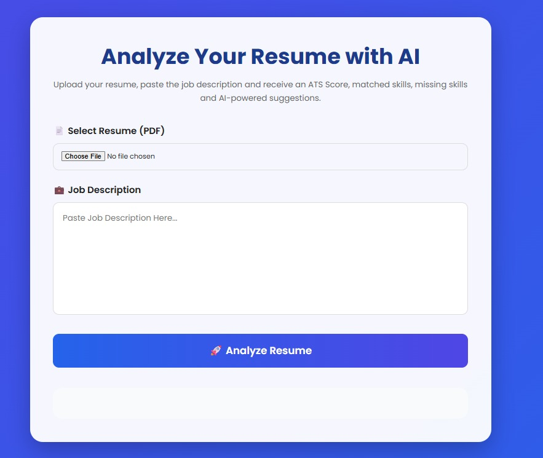
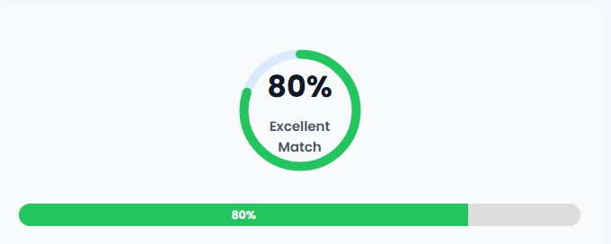
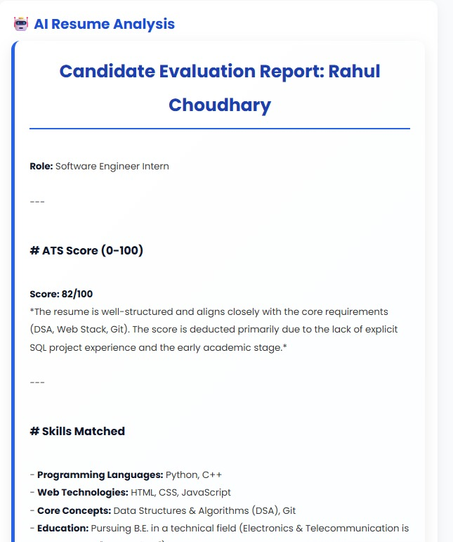
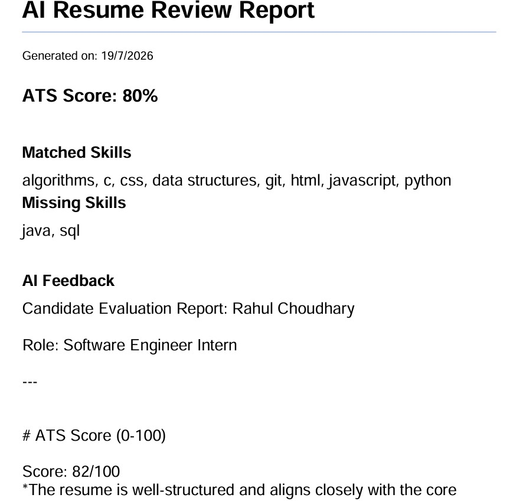

# 🤖 AI Resume Reviewer

An AI-powered Resume Reviewer that analyzes resumes against a job description, calculates an ATS score, identifies matched and missing skills, and provides personalized AI feedback using Google's Gemini AI.

---

## 🌐 Live Demo

**Frontend:** https://ai-resume-reviewer-lake.vercel.app/

**Backend API:** https://ai-resume-reviewer-j4z1.onrender.com

---

## ✨ Features

- 📄 Upload Resume (PDF)
- 💼 Paste Job Description
- 📊 ATS Score Calculation
- ⭕ Circular ATS Score Meter
- ✅ Matched Skills Detection
- ❌ Missing Skills Identification
- 🤖 AI-Powered Resume Analysis
- 💡 Resume Improvement Tips
- 📋 Copy AI Feedback
- 📄 Download Professional PDF Report
- 🗑 Clear Form
- 📱 Responsive UI
- ☁️ Cloud Deployment (Vercel + Render)

---

## 🛠 Tech Stack

### Frontend
- HTML5
- CSS3
- JavaScript

### Backend
- FastAPI
- Python

### AI
- Google Gemini AI

### PDF Processing
- PyMuPDF
- jsPDF

### Deployment
- Vercel
- Render

---

## 📸 Screenshots

### 🏠 Home Page



---

### 📊 Resume Analysis



---

### 🤖 AI Feedback



---

### 📄 PDF Report


## 📂 Project Structure

```text
AI-Resume-Reviewer/
│
├── backend/
│   ├── main.py
│   ├── ai_service.py
│   ├── utils.py
│   ├── models.py
│   └── requirements.txt
│
├── frontend/
│   ├── index.html
│   ├── style.css
│   └── script.js
│
├── README.md
└── .gitignore
```

---

## ⚙️ Installation

Clone the repository:

```bash
git clone https://github.com/rahulbhadu51-cmd/AI-Resume-Reviewer.git
```

Go inside the project:

```bash
cd AI-Resume-Reviewer
```

Create a virtual environment:

```bash
python -m venv venv
```

Activate it:

### Windows

```bash
venv\Scripts\activate
```

Install dependencies:

```bash
pip install -r requirements.txt
```

Create a `.env` file:

```text
GEMINI_API_KEY=YOUR_API_KEY
```

Run the backend:

```bash
uvicorn backend.main:app --reload
```

Open the frontend in your browser.

---

## 🚀 Future Improvements

- User authentication
- Resume history
- Multi-format resume support (DOCX)
- AI chat for resume improvements
- Cover letter generator
- Interview question generator
- Resume templates

---

## 👨‍💻 Author

**Rahul Bhadu**

GitHub: https://github.com/rahulbhadu51-cmd

---

## ⭐ If you like this project

Please consider giving it a ⭐ on GitHub!